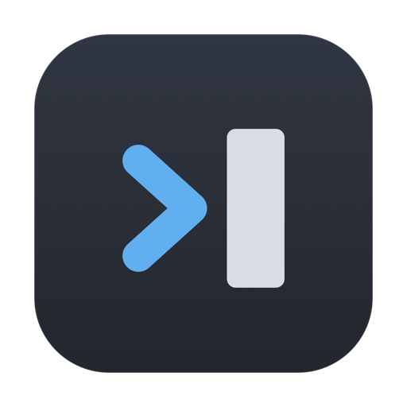
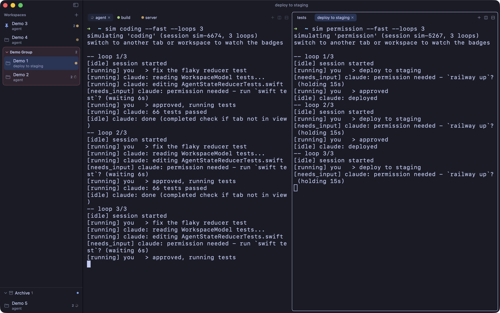
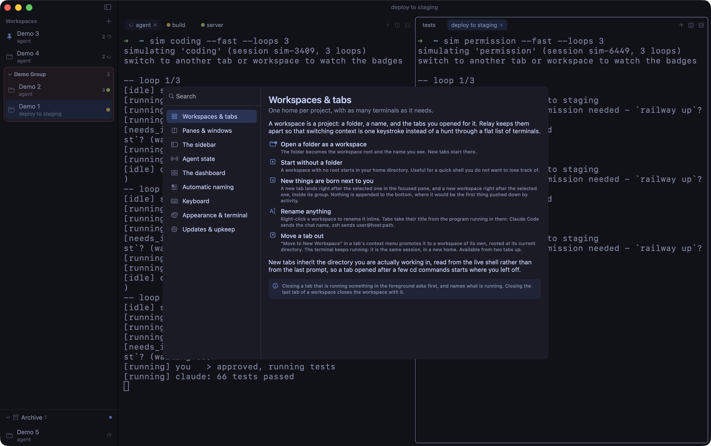
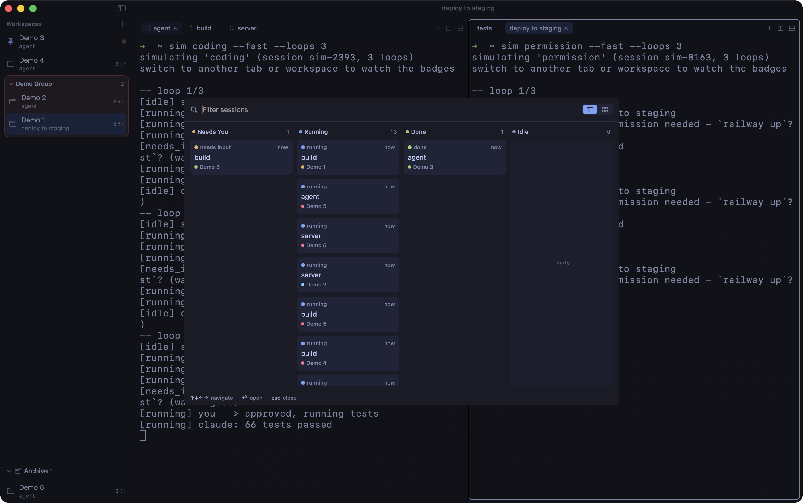

<div align="center">



# Relay

**Terminale macOS nativo per lavorare con molti coding agent in parallelo.**

[](https://github.com/essedev/relay/releases/latest)
[](https://github.com/essedev/relay/actions/workflows/ci.yml)
[](#installazione)


[](LICENSE)

[English](README.md) · **Italiano** · [Guida utente](docs/GUIDE.md)

</div>

<p align="center">
  
</p>

Terminale macOS nativo per lavorare con molti coding agent in parallelo: stati agente affidabili
(via hook Claude Code e Codex), workspace che tengono separati i progetti e una vista di triage per quando
girano dodici sessioni insieme. Veloce e leggero.

Stato: baseline chiuso e distribuito via Homebrew tap. Workspace -> pane -> tab -> terminale, agent
runtime con badge e notifiche, split panes e multi-finestra, persistence del layout, resume
assistito, disattivazione delle sessioni, dashboard di triage kanban, gruppi e archivio dei
workspace, nomina automatica dei workspace (senza configurare niente, con un LLM se vuoi nomi
migliori), onboarding, guida in-app,
dodici temi. Engine v1 SwiftTerm dietro l'astrazione
`TerminalEngine` (libghostty backend futuro). Decisioni, benchmark e log della ricerca:
`docs/research/` (`CYCLES.md`).

## Installazione

```sh
brew install --cask essedev/relay/relay-terminal
```

Aggiornamenti: `brew update && brew upgrade --cask relay-terminal`. Il cask mette anche i comandi
`relay` e `relay-cli` nel PATH, quelli che usano le sezioni qui sotto. Quando un aggiornamento aggiunge un
hook (la 0.17.0 ne ha aggiunto uno, per gli errori API), Relay rimette a posto gli hook di Claude
Code al primo avvio: il setup è idempotente, fa il backup del file e non tocca gli altri tuoi hook.
Gli hook di Codex vengono solo segnalati, mai riscritti, perché Codex chiede di
rivederli con `/hooks` ogni volta che cambiano le definizioni: `relay-cli hooks status codex` dice
quali eventi mancano, e il setup li rimette.

In alternativa scarica il `.dmg` dall'ultima
[release](https://github.com/essedev/relay/releases/latest) e trascina Relay in Applications. Relay
non è firmata con Developer ID Apple, quindi con l'installazione manuale macOS blocca il primo
avvio: apri **Impostazioni di Sistema > Privacy e Sicurezza** e premi **Apri comunque** (una volta
sola per versione). Il cask toglie la quarantena al posto tuo, quindi installando da brew quel
passaggio non serve; i due eseguibili stanno dentro `Relay.app/Contents/MacOS`.

## Cosa fa

- **Stati agente di cui fidarsi.** I badge vengono dagli hook di Claude Code e Codex, non dal parsing
  dell'output, quindi restano giusti anche sotto un muro di log. Per tab, e aggregati per
  workspace.
- **Attenzione a tre livelli.** Una sessione che ti aspetta è rumorosa; una che hai visto ma non
  ripreso resta quieta sullo sfondo; rispondere la spegne. Niente resta acceso per sempre, e niente
  si spegne prima che tu l'abbia visto.
- **Triage invece di caccia.** `Cmd+D` mette tutte le sessioni dell'app su una schermata, di default
  su quattro corsie per urgenza (il layout a griglia è a un toggle di distanza), con filtro a
  digitazione e Invio per saltarci dentro.
- **Workspace che restano in ordine.** Gruppi, pin, archivio, e un ordine che cambia solo col tuo
  drag - o quando una sessione finisce mentre stavi guardando altrove.
- **I pane ospitano le tab.** Split a destra o sotto; ogni pane ha la sua strip e la sua selezione.
  Ogni workspace può passare a una finestra sua, con tutte le sue sessioni.
- **Scorciatoie rimappabili**, dodici temi, e i terminali inutilizzati vengono scaricati: la memoria
  resta piatta anche con decine di tab aperte. ~90 MB residenti con un terminale vivo, ~92 MB con
  tredici, e il monitor di input aggiunge 2.4µs nel caso peggiore su un keystroke. Metodo e numeri
  in [`docs/research/PERF.md`](docs/research/PERF.md).

Il manuale completo è in **[docs/GUIDE.md](docs/GUIDE.md)** e dentro l'app sotto
**Help > Relay Guide** (`Cmd+?`): stesso contenuto, generato dalla stessa fonte. È in inglese, come
l'interfaccia.

<p align="center">
  
</p>

<p align="center">
  
</p>

## Stato agente (hook Claude Code e Codex)

Relay mostra lo stato di ogni agente come badge sulla tab e, aggregato, sul workspace nella sidebar
(`running`, `needs_input`, `error`, completato). Lo stato arriva dagli hook nativi degli agenti, non dal
parsing dell'output.

```sh
relay-cli hooks setup all       # installa gli hook Claude Code e Codex
relay-cli hooks status all      # verifica entrambe le integrazioni
relay-cli hooks uninstall all   # rimuove solo gli hook gestiti da Relay
```

Poi apri Relay, lancia `claude` o `codex` in una tab e i badge si aggiornano. `needs_input` resta
finché non rispondi. Lo stesso setup si fa per agente da Settings > Agents. Sostituisci `all` con
`claude` o `codex` per gestire solo quell'agente; senza argomento il default resta `claude`.

Gli hook Claude sono aggiunti a `~/.claude/settings.json`; quelli Codex a `~/.codex/hooks.json`
(oppure `$CODEX_HOME/hooks.json` se configurato). Gli hook esistenti sono preservati. Usa una
versione di Codex CLI con [supporto agli hook nativi](https://developers.openai.com/codex/hooks)
e rivedi la configurazione con `/hooks` dopo il setup e ogni volta che cambiano le definizioni.
Lo stato installato verifica il file, non la decisione di trust di Codex. Protocollo e binding in
[docs/STATE_SCHEMA.md](docs/STATE_SCHEMA.md).

Un turno ucciso da un errore API - rate limit, sovraccarico, billing, rete assente - finisce senza
concludere, quindi non arriva mai al "completato". Claude Code espone `StopFailure`, che Relay
intercetta per colorare la tab di rosso: ring, badge, float in cima alla sidebar e notifica,
come qualunque altro segnale che
non hai visto. Ogni tipo di errore ha lo stesso aspetto; i dettagli stanno nel terminale. Il retry
lo spegne. Gli hook Codex non espongono ancora un evento di fallimento equivalente: l'errore API
resta visibile nel terminale, ma non può ancora produrre lo stato rosso di Relay; il badge può
conservare l'ultimo stato fino al prossimo hook. Interrompere un turno Codex lo riporta a idle
senza notifica di completamento. Dopo un riavvio di Relay, la barra Resume supporta entrambi gli agenti.

Una sessione a cui non torni a breve non deve restare accesa: **Deactivate Sessions**, nel menu
Workspace o sulla riga in sidebar, spegne gli agenti di un workspace tenendo la via del ritorno. Le
tab restano dove sono e riaprendone una ti propone il resume. Le tab a schermo e gli agenti al
lavoro restano fuori, e la conferma dice quante e perché. Una tab disattivata non riparte mai da
sola, nemmeno col resume automatico acceso: puoi aprirla per guardarla senza riavviarla. Una
sessione agente costa un paio di centinaia di megabyte e una manciata di processi coi suoi server
MCP, e Relay non sfratta mai una tab che ne ha una viva.

Se un resume finisce in `command not found`, in quella tab qualcosa stava aspettando input e ha
preso il primo carattere come risposta: la barra Resume scrive nella shell esattamente come faresti
tu, non aspetta il prompt. La riga fallita contiene ancora l'id di sessione completo, quindi il
comando lo puoi rilanciare a mano. Per evitarlo, rispondi o silenzia qualunque cosa chieda
all'avvio della shell; per il prompt di aggiornamento di oh-my-zsh è
`zstyle ':omz:update' mode auto` in `~/.zshrc`.

Con l'app avviata dal bundle arrivano anche le notifiche macOS quando un agente chiede input, va in
errore o finisce mentre non stai guardando quella tab; cliccarne una porta la tab in primo piano. Da
`make run` (senza bundle) le notifiche sono disattivate.

Per provare i badge senza una sessione agente vera, dentro una tab di Relay:

```sh
relay-cli simulate            # chat finta (scenario "coding"), eventi reali sul socket
relay-cli simulate permission # needs_input che resta in sospeso
relay-cli simulate error      # un turno che muore su un rate limit, poi il retry
relay-cli simulate burst --loops 3 --fast
```

Per vedere l'app piena di attività: `relay --demo 5x4` apre cinque workspace da quattro tab con
sessioni simulate concorrenti (sempre sul socket reale). Relay è single-instance: chiudi prima
quella già aperta, altrimenti il flag viene ignorato e torna avanti la finestra esistente.

## Nomina automatica dei workspace

Un workspace senza cartella si chiama "Workspace 3", che smette di essere utile al terzo. Relay lo
rinomina in base a cosa sta facendo: la cartella, un comando in esecuzione in una delle sue tab, una
sessione agente attiva. Il nome pulsa mentre lo si sta cercando.

Funziona senza configurare niente: il nome si deriva da quei segnali ("yellow-hub" diventa "Yellow
Hub", "npm run dev" diventa "Npm Dev"). Aggiungi una API key in **Settings > Agents > Workspace
naming** e a scriverli è un modello: nomi migliori, e "Regenerate name" te ne dà uno diverso
(funziona anche senza chiave, sulla regola locale). L'endpoint di default è OpenRouter con un
modello economico, e un nome costa un paio di centinaia di token; va bene qualunque base URL e
modello OpenAI-compatible. I nomi che scrivi tu non vengono mai sovrascritti.

## Scorciatoie

Due assi, fissi: `Cmd+1..9` seleziona un workspace, `Option+1..9` una tab nel pane focused. Quelle
da imparare per prime:

| Tasti | Azione |
| --- | --- |
| `⌘T` / `⌘W` | Nuova tab, chiudi tab |
| `⌘\` / `⇧⌘\` | Split a destra, split sotto |
| `⌘J` / `⇧⌘J` | Salta alla prossima/precedente sessione che ti aspetta |
| `⌘D` | Dashboard di triage |
| `⌘F` / `⌘K` | Cerca nel terminale, puliscilo |
| `⌘?` | La guida dell'app |

Tutto il resto, coi default sempre allineati, sta nelle
[tabelle delle scorciatoie](docs/GUIDE.md#keyboard). Sono rimappabili da Settings > Shortcuts
(clicca una combinazione, premi la nuova), con tre eccezioni fisse: i due assi numerici qui sopra,
i tasti di controllo del terminale (`⌃C`, `⌃D`, `⌃Z`, che appartengono al programma che stai
usando) e i comandi di menu di macOS, `⌘?` incluso.

Sui layout internazionali `Option` fa anche da AltGr: quando compone un carattere stampabile
(`Option+ò` = `@`), quel carattere finisce nel terminale invece di far scattare una scorciatoia.

## Aspetto

Temi curati per il terminale (palette ANSI completa, così Claude Code, `git` e `ls` si vedono in
palette) con la chrome intonata: dodici temi in sei coppie scuro/chiaro (Relay, Solarized, Gruvbox,
Tokyo Night, Catppuccin, GitHub), più famiglia del font, dimensione e blink del cursore. Tutto da
`Cmd+,`, tutto persistito. Il modello del tema vive in `Core` (`RelayTheme`), fonte unica per
terminale e chrome.

La title bar mostra il contesto della tab attiva: il titolo impostato dal programma (Claude Code
manda il nome della chat, zsh `user@host:path`), altrimenti la cwd corrente abbreviata con `~`,
altrimenti la cartella del workspace.

## Sviluppo

Requisiti: Xcode/Swift 6, macOS 14+. I linter sono **pinnati**: `make tools` scarica le versioni
esatte di SwiftFormat/SwiftLint in `.build/tools`, così CI e locale girano la stessa. Non
installarli via brew per il giro di qualità (prenderesti una versione diversa).

```bash
make build     # build
make tools     # scarica SwiftFormat/SwiftLint pinnati in .build/tools
make run       # avvia l'app (finestra Relay, senza notifiche)
make test      # test
make check     # giro qualità completo (lint + build + test)
make run-app   # avvia dal bundle .app (notifiche attive)
make install-app  # installa Relay.app in /Applications
make guide-md  # rigenera docs/GUIDE.md dalla guida in-app
make dmg       # crea .build/Relay-<version>.dmg (installer, non firmato Developer ID)
make release   # pubblica la release corrente (VERSION): dmg -> GitHub Release -> tap brew
make help      # tutti i target
```

Le notifiche macOS richiedono un bundle id, quindi girano solo dall'app impacchettata
(`make run-app`/`install-app`), non da `make run`.

**La guida utente è generata.** `docs/GUIDE.md` e la guida in-app vengono dalla stessa fonte
(`Sources/WorkspaceModel/Guide*.swift`); un test fallisce se il file committato è disallineato.
Modifica la fonte, poi `make guide-md`. Gli screenshot qui sopra li produce
`scripts/screenshots.sh`, che pilota un'istanza demo isolata: non tocca il tuo layout né le tue
preferenze.

**Distribuzione**: la versione sta in `./VERSION` (semver). Per rilasciare: bumpa `VERSION`,
`make check`, commit, poi `make release` (routine in `CLAUDE.md`). L'installer non è firmato
Developer ID né notarizzato, quindi al primo avvio serve "Apri comunque"; firma Developer ID +
notarizzazione non sono ancora configurate.

## Documentazione

- **[`docs/GUIDE.md`](docs/GUIDE.md)** - la guida utente: tutto quello che Relay fa, generata dalla
  guida in-app (in inglese, come l'interfaccia).

Il resto è documentazione interna.

- `docs/ARCHITECTURE.md` - tesi di prodotto, moduli, budget, engine, anti-pattern.
- `docs/ROADMAP.md` - cosa manca e in che ordine (baseline chiuso; prossimo giro da decidere).
- `docs/research/CYCLES.md` - il log dei cicli di lavoro (i più vecchi in `cycles-archive/`).
- `docs/CONVENTIONS.md` - regole di codice, test e processo.
- `docs/STATE_SCHEMA.md` - schema di persistence e protocollo eventi agente.
- [`docs/features/`](docs/features) - un file per area, con le invarianti e le trappole già pagate.
  L'indice è la cartella: un elenco qui invecchia alla prima area che si aggiunge.
- `CLAUDE.md` - guida operativa per l'agent, volutamente corta: rimanda ai file qui sopra.

## Licenza

Relay è [licenziata MIT](LICENSE). Include SwiftTerm (MIT) come engine del terminale; la sua
notice sta in [NOTICE](NOTICE), che viaggia dentro l'app sotto `Relay.app/Contents/Resources`.
