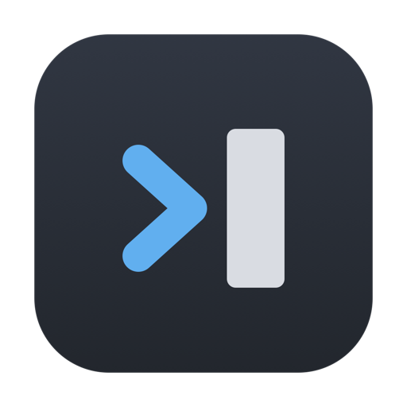
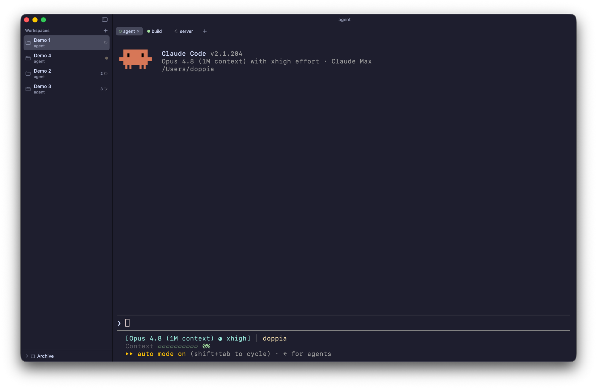

<div align="center">



# Relay

**Native macOS terminal for working with many coding agents in parallel.**

[](https://github.com/essedev/relay/releases/latest)
[](https://github.com/essedev/relay/actions/workflows/ci.yml)
[](#installation)


**English** · [Italiano](README.it.md)

</div>

<p align="center">
  
</p>

Native macOS terminal for working with many coding agents in parallel: reliable agent state
(via Claude Code hooks), workspace organization (sidebar with pinning and reordering, overview
dashboard), fast and lightweight.

Status: baseline complete and distributed via a Homebrew tap. Workspace -> Tab -> terminal, agent
runtime with badges/notifications, layout persistence, assisted resume, triage dashboard, twelve
themes. Engine v1 is SwiftTerm behind the `TerminalEngine` abstraction (libghostty a future
backend). Decisions, benchmarks and research logs live in `docs/research/` (`CYCLES.md`).

## Installation

```sh
brew install --cask essedev/relay/relay
```

Updates: `brew update && brew upgrade --cask relay`. Alternatively, download the `.dmg` from the
latest [release](https://github.com/essedev/relay/releases/latest) and drag Relay into
Applications.

The app is not signed with an Apple Developer ID, so macOS blocks it on first launch. Open **System
Settings > Privacy & Security** and click **Open Anyway** (once per version).

## Development

Requirements: Xcode/Swift 6, macOS 14+. For linting: `brew install swiftlint swiftformat`.

```bash
make build     # build
make run       # launch the app (Relay window, no notifications)
make test      # test
make check     # full quality gate (lint + build + test)
make run-app   # launch from the .app bundle (notifications enabled)
make install-app  # install Relay.app into /Applications
make dmg       # build .build/Relay-<version>.dmg (installer, not Developer ID signed)
make release   # publish the current release (VERSION): dmg -> GitHub Release -> brew tap
make help      # all targets
```

macOS notifications require a bundle id, so they only run from the packaged app
(`make run-app`/`install-app`), not from `make run`.

**Distribution**: the version lives in `./VERSION` (semver). To release: bump `VERSION`,
`make check`, commit, then `make release` (routine documented in `CLAUDE.md`). The installer is not
Developer ID signed or notarized, so first launch requires "Open Anyway"; Developer ID signing +
notarization is not set up yet.

## Shortcuts

- `Cmd+N` new workspace (no folder, starts from home).
- `Cmd+O` open a folder as a workspace.
- `Cmd+T` new tab, `Cmd+W` close tab, `Cmd+Shift+W` close workspace.
- `Cmd+1..9` select workspace, `Option+1..9` select tab (the two axes, fixed).
- `Ctrl+Tab` / `Ctrl+Shift+Tab` cycle tabs, `Cmd+Option+Down` / `Cmd+Option+Up` cycle workspaces.
- `Cmd+J` / `Cmd+Shift+J` jump to the next/previous tab that needs attention.
- `Cmd+D` open the triage dashboard of agent sessions.
- `Cmd+F` search in the terminal, `Cmd+G` / `Cmd+Shift+G` next/previous match,
  `Cmd+K` clear the terminal.
- `Cmd +/-` terminal zoom, `Cmd+0` reset size.
- `Cmd+B` show/hide the sidebar, `Cmd+,` settings.

Shortcuts (except select-by-number and system commands) are **remappable** from
Settings > Shortcuts: click a combination, press the new one (conflicts are flagged, reset
available). The window moves by dragging the title strip at the top (not the body/terminal);
double-clicking the strip zooms, like a native title bar.

## Appearance

Curated terminal theme (ANSI palette, so Claude Code/`git`/`ls` render in palette) with matching
chrome. Twelve themes in six dark/light pairs (Relay, Solarized, Gruvbox, Tokyo Night, Catppuccin,
GitHub), font family choice (installed monospace fonts), font size and cursor blink, all adjustable
from the settings panel (`Cmd+,`, master-detail with search) and persisted. The theme model lives
in `Core` (`RelayTheme`), the single source for terminal and chrome.

The title bar shows the active tab's context: the title set by the program (Claude Code sends the
chat name, zsh `user@host:path`), otherwise the current cwd (OSC 7) abbreviated with `~`, otherwise
the workspace folder.

## Agent state (Claude Code hooks)

Relay shows each agent's state as a badge on the tab and, aggregated, on the workspace in the
sidebar (`running`, `needs_input`, done). State comes from Claude Code hooks, not from parsing
output.

```bash
relay-cli hooks setup       # install the hooks into ~/.claude/settings.json (coexist with Otty)
relay-cli hooks status      # check
relay-cli hooks uninstall   # remove only Relay's hooks
```

Then open Relay, start `claude` in a tab and the badges update. `needs_input` stays until you
respond. Protocol/binding details in `docs/STATE_SCHEMA.md`.

With the app launched from the bundle (`make run-app`) you also get macOS notifications when an
agent asks for input or finishes while you are not looking at the tab (settings and sound in
`Cmd+,`; first launch asks for permission). From `make run` (no bundle) notifications are disabled.

To try the badges without a real Claude session, inside a Relay tab:

```bash
relay-cli simulate            # fake chat ("coding" scenario), real events on the socket
relay-cli simulate permission # needs_input that stays pending
relay-cli simulate burst --loops 3 --fast
```

To see the app full of activity: `relay --demo 5x4` opens 5 workspaces of 4 tabs with concurrent
simulated sessions (always over the real socket).

## Documentation

The internal docs are in Italian (English-facing surface is this README).

- `docs/ARCHITECTURE.md` - product thesis, modules, budget, engine, anti-patterns.
- `docs/ROADMAP.md` - what is done and what is missing (baseline complete; next step TBD).
- `docs/CONVENTIONS.md` - code, test and process rules.
- `docs/STATE_SCHEMA.md` - persistence schema and agent event protocol.
- `CLAUDE.md` - operational guide for the agent.
